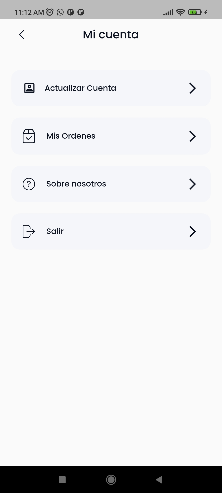

# Lula

## CONTENTS
- [Lula](#lula)
  - [CONTENTS](#contents)
- [SUMMARY](#summary)
- [BUSINESS](#business)
  - [what is it](#what-is-it)
  - [Problem](#problem)
  - [what needs?](#what-needs)
  - [Organization chart](#organization-chart)
  - [main requirement](#main-requirement)
- [DESIGN](#design)
  - [use case diagram](#use-case-diagram)
  - [class diagram](#class-diagram)
- [API ENDPOINTS](#api-endpoints)
    - [PRODUCTS ENDPOINTS](#products-endpoints)
    - [USERS ENDPOINTS](#users-endpoints)
    - [CART ENDPOINTS](#cart-endpoints)
    - [ORDERS ENDPOINTS](#orders-endpoints)
- [MOBILE](#mobile)
  - [Sitemap](#sitemap)
  - [Screens](#screens)
  - [TECHNOLOGIES](#technologies)
    - [BACKEND](#backend)
    - [MOBILE](#mobile-1)
    - [DATABASE](#database)
    - [HOSTING](#hosting)
  - [DESIGN TOOL](#design-tool)
  - [METHODOLOGY](#methodology)
  - [Thrid party Services and tools](#thrid-party-services-and-tools)

---

# SUMMARY
Lula is a plant store that offers various types of plants.
Lula is an application so that your customers can see all their plants from the comfort of their cell phone and not go directly to the store.

I had the opportunity to go to their nursery and learn more about their business.
|   |    |    |
|--------------|----------------|------------|
| | | |

I got down to work and I liked the result and so did my client.

At the end of everything my client was happy.

# BUSINESS
## what is it
Lula is a plant store and the app has the same name.
## Problem
The store is not well organized and customers only get to see the main floors and do not see all their products due to lack of time or lack of interest.
## what needs?
I offered you an app for better accessibility to all your products so you can sort all your products that belong to a certain category.
We both agreed to the proposal.
Let's get our hands dirty!

## Organization chart
- Administrator - Owner(manage the store and nursery garden)
- Employee (physical store manager)
- motorized (plant deliverer)
  

  
## main requirement
- **show** and **sell** plants

---

# DESIGN

## use case diagram

## class diagram

# API ENDPOINTS

##
### PRODUCTS ENDPOINTS
|HTTP METHOD   | API ENDPOINT   | FUNCTION   |
|--------------|----------------|------------|
|GET   | `/products/list/`            | return list of all products
|GET   | `/products/list/<slug>/`     | return detail of product by slug
|GET   | `/products/related/<id>/`    | return related products of one product by id
|GET   | `/products/category/`        | return list of products by category
|GET   | `/products/category/<id>/`   | return specific products by category by id

### USERS ENDPOINTS
|HTTP METHOD   | API ENDPOINT   | FUNCTION   |
|--------------|----------------|------------|
|POST          | `/login/`      | return token and user data
|POST          | `/users/`      | create user by phone instead of username
|PUT           | `/users/<user_id>/change_password/`      | Update password
|PUT           | `/users/<user_id>/`      | Update username 

### CART ENDPOINTS
|HTTP METHOD   | API ENDPOINT   | FUNCTION   |
|--------------|----------------|------------|
|GET           | `/cart/`            | return current shopping cart. if the cart is used return new cart.
|POST          | `/cart/`            | add product to the cart by product_id
|PUT           | `/cart/cart-item/<int:pk>/`    | update quantity of product in the shopping cart by id of product
|DELETE        | `/cart/cart-item/<int:pk>/`        | delete product of the shopping cart by id of product in the cart
|GET           | `/cart/<product_id>/`   | verify if the product is in the shopping cart by product_id

> Authorization Token is required

### ORDERS ENDPOINTS
|HTTP METHOD   | API ENDPOINT   | FUNCTION   |
|--------------|----------------|------------|
|GET           |`/orders/`         | return list of orders of the user
|POST          |`/orders/<order_code>` | return order detail of the user
|POST          |`/orders/checkout/`          | create order 
|PUT           |`/orders/checkout/`          | user can cancel order if the status does not change to received

> Authorization Token is required

# MOBILE
## Sitemap

## Screens
|   |    |    | |
|--------------|----------------|------------|-----|
| | |  |  |
| | |  |  |
| | |  |  |
| | |  |  |

## TECHNOLOGIES
### BACKEND
- DRF

### MOBILE
- Flutter (Android/iOs)

### DATABASE
- PostgreSQL

### HOSTING
- Digital Ocean

## DESIGN TOOL
- draw.io (use case, class diagram,sequence)
- Whismical

## METHODOLOGY
- Kanban (Trello)

## Thrid party Services and tools
- [ibb.co](ibb.co) (free hosting of images)
- Postman (test api endpoints)